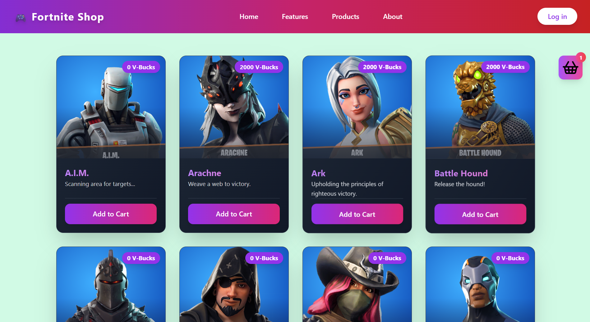
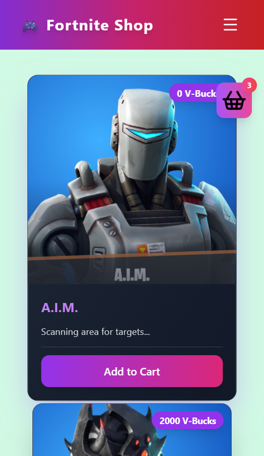
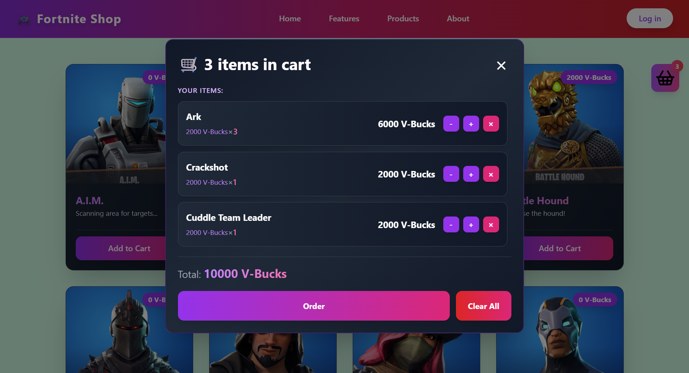

# 🎮 Fortnite Shop

A web application for purchasing items from Fortnite. A modern React application with interface based on Tailwind CSS.


## 🎥 DEMO

> **Live Demo:** [View Application](https://your-demo-url.com) *(coming soon)*

### 🖼️ Screenshots


# 📱 Main Page - Item Catalog

## Desktop



## Mobile

*Browse through 20+ Fortnite items with beautiful card design and smooth loading animations*



# 🛒 Shopping Cart

*Manage your items with quantity controls, see total price, and checkout with ease*




## ✨ Key Features

- 🛒 **Shopping Cart** - add and remove items
- 📦 **Item Catalog** - view items from Fortnite
- 🔔 **Notifications** - inform users about actions
- 🎨 **Responsive Design** - beautiful interface with Tailwind CSS
- ⚡ **Fast Loading** - data loaded from API
- 🧩 **Modular Architecture** - clean and scalable code

## 🏗️ Project Structure

```
src/
├── App/                      # Main application component
│   └── App.jsx
├── components/               # Reusable components
│   ├── common/              # Common components
│   │   ├── Main.jsx         # Main content area
│   │   ├── CartProvider.jsx # Cart provider
│   │   └── NotificationsProvider.jsx
│   ├── layouts/             # Layout components
│   │   ├── Header.jsx       # Application header
│   │   └── Footer.jsx       # Footer
│   └── ui/                  # UI components
│       ├── FTItems.jsx      # Items list
│       ├── FTItem.jsx       # Item card
│       ├── CartModal.jsx    # Cart modal window
│       ├── CartItem.jsx     # Cart item
│       └── Notification.jsx # Notifications
├── features/                # Feature modules
│   └── Cart/                # Cart functionality
│       └── Cart.jsx
├── hooks/                   # Custom React hooks
│   ├── useCart.jsx          # Cart management
│   └── useNotifications.jsx # Notifications management
├── lib/
│   ├── api/                 # API functions
│       ├── fetchFTItems.jsx # Fetch items
│       └── apiConfig.jsx    # API configuration
└── styles/
    └── style.scss           # Global styles
```

## 🚀 Quick Start

### Requirements
- Node.js 16+ 
- npm or yarn

### Installation

1. **Clone the repository**
   ```bash
   git clone <repository-url>
   cd "Fortnite Shop"
   ```

2. **Install dependencies**
   ```bash
   npm install
   ```

3. **Run the application**
   ```bash
   npm start
   ```

   The application will open in your browser at `http://localhost:1234`

### Build for Production

```bash
npm run build
```

Built files will be located in the `build/` folder

## 📦 Installing Dependencies from Scratch

If you don't have the main packages installed yet:

```bash
npm run downland
```

## 🛠️ Technology Stack

| Technology | Version | Purpose |
|-----------|---------|---------|
| **React** | 19.2.3 | UI Framework |
| **Tailwind CSS** | 3.4.19 | Utility CSS Framework |
| **Parcel** | 2.16.3 | Bundler and dev server |
| **Lucide React** | 0.561.0 | Icons |
| **SASS** | - | CSS Preprocessor |
| **PostCSS** | 8.5.6 | CSS Transformation |

## 🎯 Features

### API Integration

The application loads items data through the `fetchFTItems()` function, which makes requests to the Fortnite API using an API key.

## 🔑 API Configuration

Create a file `src/lib/api/apiConfig.jsx` with your keys:

```javascript
export const API_KEY = 'your_api_key';
export const API_URL = 'https://api.fortnite.com/...';
```

## 💻 Available Scripts

```bash
# Run the application in development mode
npm start

# Build the application for production
npm run build

# Install React, React-DOM and Parcel
npm run downland
```

## 🎨 Styles

The project uses **Tailwind CSS** for styling. Global styles are located in `src/styles/style.scss`.

Tailwind configuration: `tailwind.config.js`

**Last Update:** December 2025